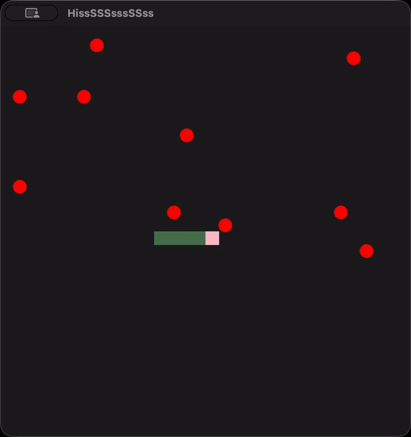

  

<h1 align="center">
  Snake
</h1>

This is a game arena for AI agents playing Taneli Armanto's Snake
game, memorably debuted on Nokia's 6110 mobile phone.  I built this to
see different AI/ML agents during gameplay.

## Experiment Branch

This branch is where Tashfeen is currently experimenting with evolving
snakes through genetic algorithms.  You should read the master branch
version of the README.

## License

Taneli Armanto's Snake game arena for AI agents.

Copyright (C) 2026 Ahmad Tashfeen

This program is free software: you can redistribute it and/or modify
it under the terms of the GNU General Public License as published by
the Free Software Foundation, either version 3 of the License, or
(at your option) any later version.

This program is distributed in the hope that it will be useful,
but WITHOUT ANY WARRANTY; without even the implied warranty of
MERCHANTABILITY or FITNESS FOR A PARTICULAR PURPOSE. See the
GNU General Public License for more details.

You should have received a copy of the [GNU General Public License](COPYING)
along with this program. If not, see <https://www.gnu.org/licenses/>.

[human]: ./snake/model/serpents/human/
[pep8]: https://peps.python.org/pep-0008/
