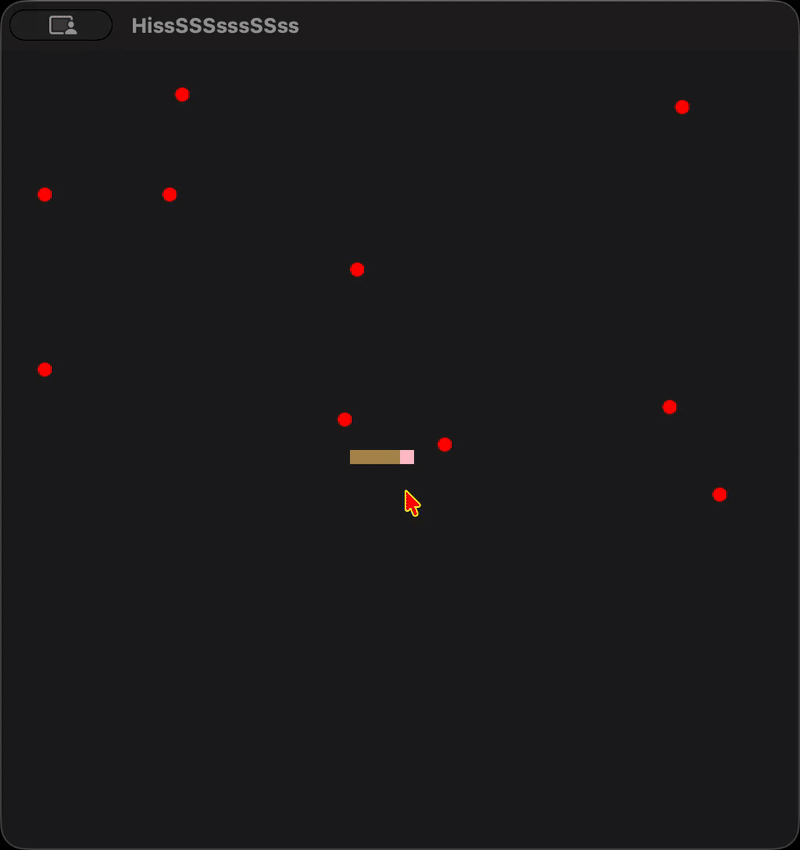

  

<h1 align="center">
  Snake
</h1>

This is a game arena for AI agents playing Taneli Armanto's Snake
game, memorably debuted on Nokia's 6110 mobile phone.  I built this to
see different AI/ML agents during gameplay.

## Getting Started

To get started you'll need to be familiar with Python, PIP and Model
View Control architecture.

### Virtual Environment

It is better to work in a virtual environment so as to not mess up
your system's python packages. Before creating one, check which python
you are currently accessing with `which python3` or your binary maybe
called `python`, in which case try `which python`. I believe the
Windows equivalent of the `which` command is `where` hence for Windows
you can try `where python3`.

Here is how to create a virtual environment,

~~~
python3 -m venv .venv
~~~

This creates a virtual environment in the current working directory
within a directory named `.venv`.

Now activate the virtual environment with,

~~~
source .venv/bin/activate
~~~

And for Windows (PowerShell),

~~~
.venv\Scripts\Activate.ps1
~~~

Now check the `which python3` again, and you should see a different
path from last time. I have seen `where python3` return nothing on
Windows, try `pip list` before and after. If you see a different list
of packages, then you have most likely changed the environments
successfully.

### Install Snake

You need to run,

~~~
pip install -e ".[dev]
~~~

and then check the installation with,

~~~
pip show snake
~~~

### Run Snake

Execute `snake`.

## Adding an Agent

Start by looking into [./snake/model/serpents/human/][human].  This
agent is for a human player and can act as an example for how to set up
a directory.

1. Create a directory inside `./snake/model/serpents/`. For example,
   `./snake/model/serpents/basilisk/`.
2. Create a file `./snake/model/serpents/basilisk/__init__.py` with
   contents,
   
   ~~~python
   from snake.model.serpents.basilisk.basilisk import basilisk
   ~~~
3. Create a file `./snake/model/serpents/basilisk/basilisk.py` with
   contents,
   
   ~~~python
   from snake.model.serpents import Snake

   class Basilisk(Snake):

       def __init__(self, W, H, apples):
           super().__init__(W, H, apples)
           # your instance variables here

       @property
       def name(self):
           return 'Your Name'

       def turn(self):
           # implement your snake's turning logic
   ~~~

The class `snake.model.serpents.Snake` is abstract. You must implement
the property `name` that must return your name and the abstract method
`turn(self)`.

Note that there is also another abstract class
`snake.model.serpents.Ophion` that implements sensor information. You
can instead extend it with,

~~~python
from snake.model.serpents.ophion import Ophion

class Basilisk(Ophion):
    ....
~~~

You may write any other helper modules you like in
`./snake/model/serpents/basilisk/` and adjust
`./snake/model/serpents/basilisk/__init__.py` accordingly. You may not
change anything outside.

## Conclusion

Open an issue if you have a question. If you are Tashfeen's student,
then please just email them or see them during office hours.

## License

Taneli Armanto's Snake game arena for AI agents.

Copyright (C) 2026 Ahmad Tashfeen

This program is free software: you can redistribute it and/or modify
it under the terms of the GNU General Public License as published by
the Free Software Foundation, either version 3 of the License, or
(at your option) any later version.

This program is distributed in the hope that it will be useful,
but WITHOUT ANY WARRANTY; without even the implied warranty of
MERCHANTABILITY or FITNESS FOR A PARTICULAR PURPOSE. See the
GNU General Public License for more details.

You should have received a copy of the [GNU General Public License](COPYING)
along with this program. If not, see <https://www.gnu.org/licenses/>.

[human]: ./snake/model/serpents/human/
